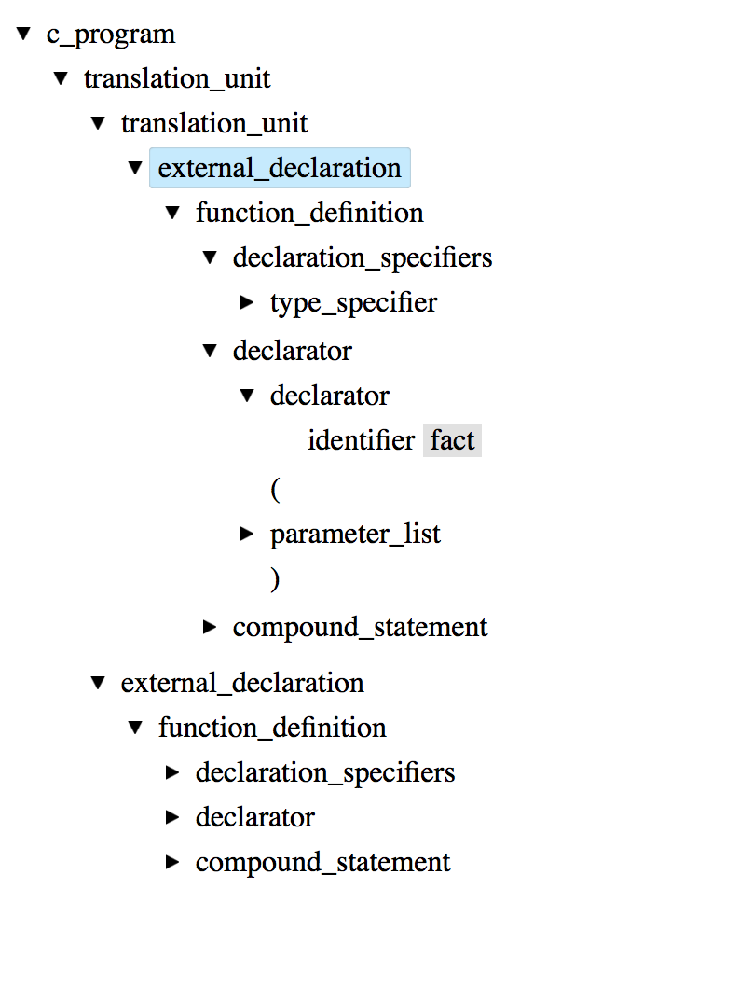
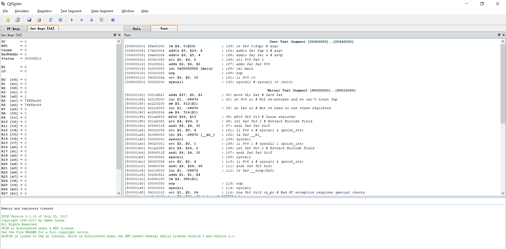
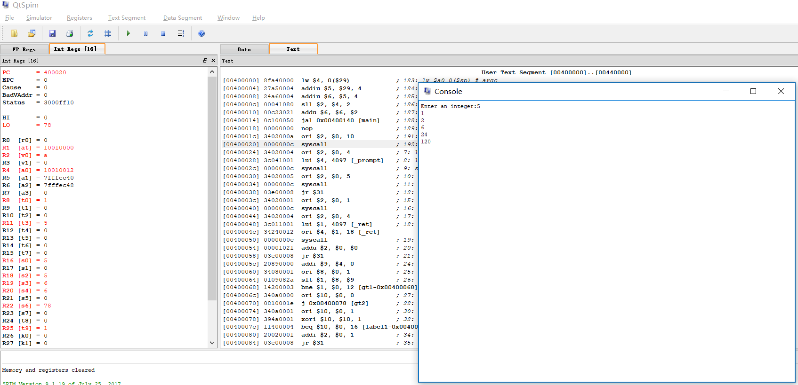

#  编译原理大作业实验报告

- 张清 3150105495
- 郝广博 3150104785
- 桂晓琬 3150104802

## 总体设计

* 我们将C语言文法进行修改，设计了一个可以解析简单C语言程序的编译器，可以生成我们自定义的一套中间代码，并且最终可以将中间代码翻译为MIPS汇编代码

* 根据编译器的通常设计方法（源程序--中间代码--目标代码），我们将编译器的设计分为了三个部分：
  1. 前端部分：对源程序进行词法分析和语法分析，生成语法分析树
  2. 中端部分：解析语法分析树，生成中间代码
  3. 后端部分：翻译中间代码，生成目标代码
* 使用语言/工具：
  1. 前端：C++ / flex, bison
  2. 中段：Python 3.6
  3. 后端：Python 3.6
  4. 效果展示：
     * 运行MIPS代码：SPIM 模拟器
     * 语法分析树展示：angular, angular-tree-component
* 运行方式：
  1. 在frontend目录中运行./build.sh生成语法分析器，运行./test.sh解析demo/demo.c，并生成demo/syntax-tree.json
  2. 在middleend目录中运行main.py，生成demo/intermediate.txt
  3. 在backtend目录中运行main.py，生成demo/result.asm
  4. 在模拟器SPIM中打开result.asm，运行即可

## 前端部分

### 总体思路 

在前端部分我们定义了一棵"first child,brother"型的二叉树作为我们的语法分析树，从文法的起始符号开始解析，每解析一个非终结符将生成一个二叉树的非叶节点，每解析到一个终结符（token）将生成一个二叉树的叶节点；最后为了方便后面生成中间代码，我们遍历整棵二叉树，根据树节点的成员变量生成一个json文件用来表示语法分析树

### 数据结构

#### 语法分析树

```c
class TreeNode {
public:
    string content = "";
    string name = "";
    int row = 0;
    int col = 0;
    TreeNode *first_child;
    TreeNode *next_sibling;
    TreeNode()=default;
    TreeNode(string name);
    TreeNode(string name, string content);
    TreeNode(string name, int num, ...);
    void write_json(string path);
private:
    void traverse(TreeNode *node, ofstream &outfile);
};
```

##### 数据

数据方面，我们给每一个树节点定义了几个属性。content表示节点内容，first_child表示节点左儿子，next_sibling表示节点右边兄弟。

##### 函数

TreeNode构造函数负责建立新的节点。以其中一个函数为例：

通过构造函数传入变长参数，num控制参数个数。其中，num表示该节点子节点的个数，变长参数为所有子节点的地址。

~~~c
TreeNode::TreeNode(string name,int num,...):TreeNode(name)
~~~

通过va_list控制变长参数的获取。

~~~c
    va_list valist;
    //创建节点
    //连接子树
    va_start(valist,num);
~~~

在连接子节点的过程中，通过temp存储每一个子节点。对于第一个子节点，把它设为当前节点的左儿子，对于后面的每个子节点，把它们分别设为前一个子节点的右儿子，即兄弟节点。

当前节点的行号和列号都取为左儿子的行号和列号。

~~~c
    if(num>0){
        TreeNode *temp=va_arg(valist,TreeNode*);
        this->first_child=temp;
        this->content="";
        if(num>1){
            while(--num){
                TreeNode *temp2=va_arg(valist,TreeNode*);
                temp->next_sibling=temp2;
                temp=temp2;
            }
        }
        this->col = first_child->col;
        this->row = first_child->row;
    }
~~~
##### 生成语法分析树

语法分析树我们采用json的格式进行生成。json结构清晰，格式固定，能很好的保存树的树结构和内容，便于输出、存储、读取和分析。

~~~c
void TreeNode::traverse(TreeNode *node, ofstream &outfile)
~~~

树的遍历采用前序遍历。

先打印根节点信息，随后分别递归遍历左子树和右子树。

```c
    outfile << "{";
    outfile << "\"name\":\"" << node->name << "\",";
    outfile << "\"content\":\"" << node->content << "\",";
    outfile << "\"row\":" << to_string(node->row) << ",";
    outfile << "\"col\":" << to_string(node->col) << ",";
    outfile << "\"children\":[";
    if(node->first_child){
        traverse(node->first_child, outfile);
    }
    outfile << "]";
    outfile << "}";
    if(node->next_sibling){
        outfile << ",";
        traverse(node->next_sibling, outfile);
    }
```

并且把遍历结果输出到文件里便于读取。

```c
void TreeNode::write_json(string path){
    ofstream outfile;
    outfile.open(path);
    traverse(this, outfile);
    outfile.close();
}
```
### 词法分析

词法分析阶段是将代码扫描并且将匹配出文法中的终结符，同时，生成对应的`TreeNode`，将其放入`yylval.node`中，并且计算出当前的行号和列号。

例如：

```python
{L}({L}|{D})*     {yylval.node = new TreeNode("identifier", yytext); count_col(); return(IDENTIFIER); }
```

这段代码会将正则表达式`{L}({L}|{D})*`匹配到的字符串生成一个对应的`identifier`类型的`TreeNode`，并且把匹配到的字符串内容放到`treeNode.content`中。然后，调用`count_col`函数计算列号。最后，返回一个`token`。

```python
"for"             {yylval.node = new TreeNode("for"); count_col(); return(FOR); }
```

这一行则是匹配标识符"for"。

对于列号和行号的统计，我们是通过`count_col`和`count_row`实现的：

```python
void count_col(void){
  int i;
  for (i = 0; yytext[i] != '\0'; i++){
    if(yytext[i] == '\t'){
      yycol += 8 - (yycol % 8);
    }else{
      yycol++;
    }
  }
  ECHO;
}

void count_row(){
  yycol = 1;
  yyrow++;
}
```

其中，count_col在每一次匹配到token的时候都会执行，而count_row则只会在匹配到换行符的时候执行：

```python
"\n"              { count_row(); }
```

### 语法分析

#### 语言文法

语言文法部分我们主要是对C语言进行修改，使用了其部分文法。支持了C语言中包括变量声明和初始化，函数定义和调用，数组和指针，选择、跳转、循环、标签、复合、表达式语句。详细的文法请参阅我们的工程中的frontend/frontend.y

#### 语义动作

在语法分析部分的语义动作比较简单，主要是根据非终结符的文法来生成对应的二叉树节点，以下面的function_definition文法为例：

```c++
function_definition:
    declaration_specifiers declarator declaration_list compound_statement{
        $$=new TreeNode("function_definition",4,$1,$2,$3,$4);
//树节点的构造函数第一个参数为非终结符名字，第二个参数为对应生成式的非终结符个数，剩下几个参数分别为指向各个非终结符对应的数节点的指针
    }
    | declaration_specifiers declarator compound_statement{
        $$=new TreeNode("function_definition",3,$1,$2,$3);
    };
```
#### 规约优先级设置

在使用yacc来进行语法分析的过程中常常会产生“移进——规约”冲突，我们对于必要的冲突进行了处理，这里以"if "和"if else"两种选择语句为例来进行说明：

```c++
%nonassoc LOWER_THAN_ELSE
%nonassoc ELSE
//这里声明了两个没有结合性的token，其中ELSE拥有更高的优先级，而在下面选择语句文法的第二项末尾中使用%prec LOWER_THAN_ELSE表明了这条操作的优先级和LOWER_THAN_ELSE一样，而LOWER_THAN_ELSE的优先级低于ELSE，所以在这个移进规约冲突中，会优先执行移进操作
selection_statement:
      IF '(' expression ')' statement ELSE statement{
      $$=new TreeNode("selection_statement",7,$1,$2,$3,$4,$5,$6,$7);    
    }
    | IF '(' expression ')' statement %prec LOWER_THAN_ELSE{//这条语句的优先级更低
      $$=new TreeNode("selection_statement",5,$1,$2,$3,$4,$5);    
    }
```
#### 错误恢复

在语法分析阶段我们也做了错误恢复处理，为了使得扫描器在遇到错误时能够跳过当前错误继续扫描以输出全部的错误信息，在yacc中支持使用error关键字来实现错误恢复：

```c++
type_specifier: 
     VOID{
      $$=new TreeNode("type_specifier",1,$1);
      }
    | CHAR{
      $$=new TreeNode("type_specifier",1,$1);
      }
    | INT{
      $$=new TreeNode("type_specifier",1,$1);
      }
    | DOUBLE{
      $$=new TreeNode("type_specifier",1,$1);
      }
    | error IDENTIFIER {
      flag=1;  };
//在最后一句这里加上了error关键字，表明在解析的时候这里可能会遇到错误。在后面加上IDENTIFIER这个token表示告诉扫描器继续扫描直到遇到一个IDENTIFIER token为止
```
## 中端部分

### 总体思路

中端部分的主要任务是解析语法分析树并且产生中间代码，在这个部分我们的总体思路里根据文法逻辑来递归地解析语法分析树，不断的调用下一级的解析函数来解析。

### 中间代码定义

| Grammer                         | Description                                                  |
| :------------------------------ | :----------------------------------------------------------- |
| LABEL label_name :              | 声明标签                                                     |
| left := right                   | 赋值语句                                                     |
|                                 | right: var binomial_op var \| var \| unary_op var \| *temp \| &temp \| array_element \|   CALL f(var1,var2,var3...) |
|                                 | var: temp \| constant                                        |
|                                 | left: temp \| array_element \| *temp                         |
|                                 | array_item: temp[var]                                        |
|                                 | temp必须只含有小写英文字母、数字、下划线，且首字符是字母     |
| GOTO label1                     | 无条件跳转至标签处                                           |
| IF var GOTO label1              | 条件语句                                                     |
| IFNOT var GOTO label1           | 条件语句                                                     |
| RETURN var                      | 函数返回                                                     |
| MALLOC var1[size]               | 申请大小为size的内存空间，并将申请到的连续内存首地址赋给var1 |
| CALL f (var1,var2,var3...)      | 调用函数并不需要返回值                                       |
| Function   f(var1,var2,var3...) | 声明函数f                                                    |


#### 关于运算符

| 类别       | 内容                                                   |
| ---------- | ------------------------------------------------------ |
| 单目运算符 | +   -   ~ !                                            |
| 关系运算符 | <   >   <=   >=   !=  ==                               |
| 算术运算符 | +   -   *   /   %   \|   ^   &                         |
| 逻辑运算符 | \|\|   &&                                              |
| 移位运算   | >>   <<                                                |
| 赋值运算符 | =   +=   -=   *=   /=   %=   &=   ^=   \|=   <<=   >>= |


### 数据结构

为了解析语法分析树，我们定义了下列数据结构：

#### Block 

我们首先定义了Block类，这个类的作用是描述一个作用域（我们定义一对{ }之间的内容处在一个作用域中）主要用于管理这个作用域中的变量、标签和函数信息（如果这个作用域恰好是一个函数体）

```python
class Block:
  function_node=None   #函数节点
  variable_map=None	   #变量符号表
  label_map=None	   #label映射表
 
  break_label=None     #如果break，将会跳到哪个label
  continue_label=None  #如果continue，将会跳到哪个label
  goto_label=None      #如果goto，将会跳到哪个label

  def __init__(self):
    self.variable_map={}
    self.label_map={}
```
#### TempElement

我们使用TempElement类来管理一个变量的信息：

```python
class TempElement:
  name=None
  type=None #'int'|...
  is_pointer=False

  def __init__(self, name=None, type=None, is_pointer=False):
    self.name=name
    self.type=type
    self.is_pointer=is_pointer

  def __str__(self):
    return self.name
```
#### ConstantElement

我们使用ConstantElement类来管理常数信息:

```python
class ConstantElement:
  type = None #'int'|...
  value = None

  def __init__(self, type=None, value=None):
    self.type = type
    self.value = value

  def __str__(self):
    return self.value
```
#### ArrayItemElement

我们使用ArrayItemElement类来管理数组信息:

```python
class ArrayItemElement:
  array:TempElement = None
  index: TempElement or ConstantElement = None		#数组下标索引

  def __init__(self, array:TempElement=None, index: TempElement or ConstantElement=None):
    self.array = array
    self.index = index

  def __str__(self):
    return str(self.array) +'[' + str(self.index) + ']'
```
#### IdentifierElement

我们使用IdentifierElement类来管理一个identifier的信息:

```python
class IdentifierElement:
  name = None

  def __init__(self, name=None):
    self.name = name

  def __str__(self):
    return self.name
```
#### FunctionElement

我们使用FunctionElement类来管理一个函数的信息：

```python
class FunctionElement:
  is_defined=False		#是否定义过
  name=None			    #函数名
  return_type=None		#返回类型
  arguments=[]			#参数列表

  def __init__(self, name=None, return_type=None, is_definition=False, arguments=None):
    self.is_defined=is_definition
    self.name=name
    self.type=return_type
    if arguments is not None:
      self.arguments=arguments
    else:
      self.arguments=[]
  def __str__(self):
    return self.name
```
#### IRWriter

我们使用IRWriter类来生成输出目标代码，这个类作为一个辅助类，能够使得我们的主体解析部分更加简洁明了,出于篇幅考虑，这里我们仅展示这个类的成员变量和少量成员函数：

```python
class IRWriter:
  outfile = None
  CodeList=[]

  def write(self):
    for code in self.CodeList:
      self.outfile.write(code+'\n')

  def __init__(self, path):
    self.outfile = open(path,"w")

  def create_label(self, label):
    #self.outfile.write('LABEL %s:\n'%label)
    code='LABEL '+label+':'
    self.CodeList.append(code)

  def binomial_operation(self, dist, src1, operand, src2):
    self.assignment(
      dist,
      str(src1) + ' ' + operand + ' ' + str(src2)
    )
```
#### Loggable和ParseError

为了在解析的过程中能够方便的输出错误信息和抛出异常便于我们及时处理，我们设计了Loggable和ParseError类：

```python
class Loggable():
  row = None
  col = None
  message = ''
def error(loggable):
  if loggable.row is not None and loggable.col is not None:
    print('At %d:%d'%(loggable.row, loggable.col))
  print(loggable.message)


class ParserError(Exception, Loggable):
  def __init__(self, node, message):
    self.row = node['row']
    self.col = node['col']
    self.message = message
```
### 解析语法树

由于前端会生成一个树语法结构来表示代码的内容，我们在中端进行语法分析的时候，也只需要沿着树的结构一级一级的进行递归分析，在这一部分我们将选择一些比较重要的内容来介绍。

首先，会从`parse`函数开始分析过程：

```python
def parse(self):
  #预定义两个已有函数
  print_node=FunctionElement("print", "void", True)
  param_node=TempElement(name='print_value',type="int")
  print_node.arguments.append(param_node)

  read_node=FunctionElement("read", "int", True)

  self.function_pool["print"]=print_node
  self.function_pool["read"]=read_node

  if self.syntax_tree['name'] != 'c_program':
    err = ParserError(self.syntax_tree, 'Root node must be an "c_program"')
    logger.error(err)
  else:
    self.parse_c_program(self.syntax_tree)
```

然后对其中的名为`c_program`的节点，会调用`parse_c_program`，将其移交给下一层的分析函数处理：

```python
"""
c_program
  : translation_unit
"""
def parse_c_program(self, node:dict):
  children = node['children']
  self.parse_translation_unit(children[0])
```

然后，由于一个`c_program`是一个`translation_unit`，我们会再调用`parse_translation_unit`函数。如此往复，直到最底层。

#### expression

表达式可以用于赋值、可以用来作为if/while/for语句的条件判断，但是它本质上，是一个临时变量、一个常量或者一个数组元素，也即上面提到的`TempElement`、`ConstantElement`和`ArrayItemElement`。为了便于表述，我们把这三个类统称为`ValueElement`。

想清楚这一点以后，我们只需要让每一个子类型的expression分析函数返回一个`ValueElement`。例如：

```python
"""
additive_expression
  : multiplicative_expression
  | additive_expression '+' multiplicative_expression
  | additive_expression '-' multiplicative_expression
"""
def parse_additive_expression(self, node:dict) -> TempElement or ConstantElement or ArrayItemElement:
  children = node['children']
  if len(children) == 1:
    return self.parse_multiplicative_expression(children[0])
  else:
    return self.do_binomial_operation(
      self.parse_additive_expression(children[0]),
      children[1]['name'],
      self.parse_multiplicative_expression(children[2])
    )

def do_binomial_operation(self, src1, operand, src2, type='int'):
  result = self.create_temp(type)
  self.ir_writer.binomial_operation(
    result,
    src1,
    operand,
    src2
  )
  return result
```

在这个分析加法表达式的函数中，我们会通过`do_binomial_operation`函数创建一个临时变量，然后创建一条中间代码，把`parse_additive_expression(children[0])`和`parse_multiplicative_expression(children[2])`分析得到的两个`ValueElement`进行加法运算，并把计算结果赋值给这个新创建的临时变量。最后，把这个新创建的临时变量返回给上一级。

#### constant & identifier

常量和标识符的分析是在`parse_primary_expression`函数中进行的：

```python
"""
primary_expression
  : IDENTIFIER
  | CONSTANT_INT
  | '(' expression ')'
"""
def parse_primary_expression(self, node:dict) -> TempElement or IdentifierElement or ConstantElement:
  children = node['children']
  if children[0]['name'] == 'identifier':
    return IdentifierElement(children[0]['content'])
  elif children[0]['name'] == 'constant_int':
    return ConstantElement('int', children[0]['content'])
  else:
    return self.parse_expression(children[1])
```

在这里，我们会创建一个`IdentifierElement`或者`ConstantElement`。

#### labeled statement

标签语句会对应生成中间代码中的一条标签记录。但是，由于switch…case…语句中的case部分也是属于labeled statement，就需要在这里进行一些特殊处理：

```python
if children[0]['name'] == 'case':
  finish_label = self.create_label()
  condition = self.create_temp('int')
  self.ir_writer.binomial_operation(
    condition,
    case_compare_element,
    '==',
    self.parse_logical_or_expression(children[1])
  )
  self.ir_writer.if_not_goto(condition, finish_label)
  self.parse_statement(children[-1], case_compare_element)
  self.ir_writer.create_label(finish_label)
elif children[0]['name'] == 'default':
  pass # do nothing
```

这里的处理逻辑其实和下面将要提到的if语句非常类似。

由于case语句本身只包含了比较操作的其中一方，因此另一方需要通过参数`condition`由父级分析函数传递进来。

#### selection statement

选择语句包括了：if... / if…else… / switch…case… 三种。

以if…else…的分析为例：

```python
t = self.parse_expression(children[2])
else_label = self.create_label()
finish_label = self.create_label()
self.ir_writer.if_not_goto(t, else_label)
self.parse_statement(children[4])
self.ir_writer.goto(finish_label)
self.ir_writer.create_label(else_label)
self.parse_statement(children[6])
self.ir_writer.create_label(finish_label)
```

这里用到了两个label：`else_label`和`finish_label`。如果if表达式的值不成立，就跳转到`else_label`，执行else语句块的内容，否则，就继续执行，在执行完if语句块的内容，执行完成后，跳转到`finish_label`。

#### iteration statement

循环语句这里的处理是分别针对for 语句和 while两类语句来分析的，这两种语句在本质上是等价的，都是将循环语句解析为条件判断和执行语句两大部分。这里我们以while语句为例来说明：

```python
 WHILE '(' expression ')' statement
```

这是一句while语句的文法，为了解析这句话，我们需要按照这样的流程来执行分析：

1. 创建一个新的Block并将这个Block添加到Block栈中，并在其中声明三个标签：

   * while label：这个标签位于条件判断中间代码处
   * statement label：这个标签位于执行语句中间代码处
   * next label：这个标签位于下一句中间代码处

2. 解析表达式

   这里解析表达式，将其翻译为一个IF语句：

   `self.ir_writer.create_label(label1)`

   `expression_element=selfparse_expression(expression)`

   `self.ir_writer.if_goto(expression_element,label2)`

3. 解析执行语句

   直接调用解析语句函数即可，在之后从Block栈中把当前Block弹出

#### jump_statement: 

跳转语句的解析相对比较简单，主要需要解析break,continue和return三类跳转语句，对于break和continue语句，只需要在当前的Block栈中找到第一个可以break/continue的label,然后直接跳转到这个label；而对于return语句而言，则只需要直接调用return语句函数即可。

#### compound_statement

解析复合语句相对比较简单，因为在复合语句中最终只有两种类型的语句，一是statement，二是definition，针对这两种语句直接调用对应的函数即可。

#### function_definition

函数定义是c语言与声明一样重要的部分，对于函数定义的处理会比较复杂：

1. 首先需要逐个解析函数的返回类型（void,int......)
2. 接下来就需要解析到函数名字，并且根据函数名字来检查函数是否被声明，如果已经被声明，则检查是否被定义，如果已经定义了则报错，如果没有定义那么便说明这个定义是合法的。
3. 构造一个FunctionElement 和一个Block，将当前Block添加到Block栈中
4. 接下来则主要是为FunctionElement添加各种信息，包括函数名和参数列表
5. 调用参数列表解析函数并将其添加到FunctionElement中
6. 将该FunctionElement添加到函数池function_pool中
7. 调用解析复合语句函数开始解析函数体
8. 在解析完符合语句之后从栈中弹出当前Block，完成函数定义解析

#### declaration

最后我们介绍声明语句的解析，声明语句的解析也比较简单：

```python
  def parse_declaration(self, node:dict):
    declaration_specifiers=node['children'][0]
    #这种情况形如  int ;  不需要继续解析
    if node['children'][1]['content']==';':
      return None

    var_type=declaration_specifiers['children'][0]['children'][0]['name']
    if var_type=='void':
      message=r"void can't be declaration specifier"
      logger.error(ParserError(node,message))
    init_declarator_list=node['children'][1]
    self.parse_init_declarator_list(var_type,init_declarator_list)
    return None
```

主要是调用下层函数来分别解析类型符和声明变量两部分即可。

## 后端部分

### 总体思路

后端部分的主要任务是将中间代码翻译为目标代码，这一部分我们的做法是首先扫描一遍全部中间代码，对其做分割处理以列表的形式保存，并且针对每整个中间代码构造出它的活跃分析表便于之后做寄存器分配，并且构建变量符号表和label管理表。之后逐行翻译中间代码生成目标代码。

### 数据结构

#### Reg

出于管理方便，我们设计了Reg类用于管理它的各种信息：

```python
class Reg:
  name=None
  available=None
  variable_name=None	#当前映射到的变量名
  is_spilled=None		#是否被溢出
  spilled_var=None
  def __init__(self,reg_name):
    self.name=reg_name
    self.available=True
    self.variable_name=None
    self.is_spilled=False
    self.spilled_var=None
```
#### Liveness_analysis

在寄存器过程中，为了了解各个变量的生命周期和使用需求，我们构造活跃分析类来做这个事情，下面是活跃分析类的成员变量，关于活跃分析的计算和寄存器分配策略我们将在之后介绍，故这里不单独列出这个类的成员函数：

```python
class Liveness_analysis:
  code_list=None		#记录每句中间代码经过分析处理后的信息
  code_lines=None		#中间代码
  label_line=None		#记录每个label对应的行号
  variable_line=None	#记录每个变量对应的行号
```
#### Code

使用Code类来记录每一句中间代码的信息：

```python
class Code:
  line_no=None    		#行号
  function_name=None	#这句代码所在的函数名
  succeed=None			#这句代码的后继（这句代码之后可能会执行的代码行号的集合）
  define=None			#这句代码定义的变量列表
  use=None			    #这句代码使用的变量列表
  var_in=None			#对于这句代码的入口活跃的变量集合 
  var_out=None			#对于这句代码的出口活跃的变量集合

  def __init__(self,line_no,function_name,succeed_no=None):
    self.line_no=line_no
    self.function_name=function_name
    self.succeed = []
    self.define = []
    self.use = []
    self.var_in = set()
    self.var_out = set()

    if succeed_no is not None:
      self.succeed.append(succeed_no)
```
#### MIPSWriter

这个类和中间代码的IRWriter类一样是一个辅助类，便于生成目标代码，这里同样只展示部分成员函数：

```python
class MIPSWriter:
  outfile = None
  CodeList=[]

  def write(self, code):
    self.outfile.write('\t'+code+'\n')

  def li(self,dst,constant):
    self.write('li $'+dst+','+constant)

  def move(self,dst,src):
    self.write('move $'+dst+',$'+src)

  def sw(self, reg, address, offset=0):
    self.write('sw $'+reg+','+str(offset)+'($'+address+')')
```
#### StackFrame

在我们的设计中，栈帧主要是用来保护寄存器的，`sp`寄存器用来保存当前的栈帧起始位置。当发生函数调用时，会创建一个新的栈帧，然后将普通寄存器和`ra`寄存器保护起来。当函数退出时，会将这些寄存器的值恢复，然后释放栈帧空间。 

### 寄存器分配策略

关于寄存器分配的策略部分我们主要使用了活跃分析+线性扫描的方式来完成了，下面针对具体的策略内容来叙述。

#### 活跃分析计算

活跃分析的计算主要参考了课本中的活跃分析算法：

```python
def cal_liveness(self):
    while(True):
      can_break=True
      for code in self.code_list:
        var_in_final=code.var_in.copy()		#拷贝当前的in集合
        var_out_final=code.var_out.copy()	#拷贝当前的out集合
        code.var_in=set(code.use)|(code.var_out-set(code.define))	#计算新的in集合
        code.var_out=set()
        for succ in code.succeed:
          code.var_out=code.var_out|self.code_list[int(succ)].var_in#计算新的out集合
        if code.var_in-var_in_final==set() and code.var_out-var_out_final==set():
          pass
        else:
          can_break=False
      if can_break==True:
        break				#如果每一句中间代码的in和out集合都不再发生变化，退出
```
#### 寄存器分配策略

我们的寄存器分配策略主要利用活跃分析表来做线性扫描，具体的策略是（用伪代码表示）：

```python
input: var_name,line_no
output: reg_name  ('t0'--'t9','s0'--'s9')
algorithm:
	if find the var_name in the var-reg table
    	return reg.name
    else find an available reg 
    	if success
        	return the reg.name
    	else
        	delete the vars that will not use later in the var-reg table
        	find an available reg again
            if success
            	return the reg.name
            else 
            	random select a reg to write it into the memory
                record the information about the memory
                return the reg.name
```
### 生成目标代码

生成目标代码的总体思路之前已经介绍，这里就主要针对一些典型的中间代码来进行说明：

#### Label型语句

这里比较简单，只需要简单的将label输出到目标代码即可，形如：

`self.mips_writer.write_label(line[1]) `

#### Return型语句  

这里主要做的工作是将函数的返回值写到v0寄存器，然后 ja $ra  即可，形如：

`self.mips_writer.addi('v0', self.regs.get_normal_reg(variable,self.line_no)) `

`self.mips_writer.jr('ra') `

#### CALL型语句

调用函数这里要做的工作比较复杂，首先要保存当前所用的寄存器，然后将传递的实参值写到a0-a3寄存器中，然后jal 到函数中，在函数结束后取回之前保存的寄存器值，并且将v0寄存器中的值适当赋值（如果需要），形如：

`self.mips_writer.addi('sp', 'sp', -use_amount) `

`self.mips_writer.sw(reg, 'sp', count) `

`self.mips_writer.addi('a'+str(param_count-1),self.regs.get_normal_reg(param, self.line_no))`

`self.mips_writer.jal(function_name) `

`self.mips_writer.lw(reg, 'sp', count) `

`self.mips_writer.addi('sp', 'sp', use_amount) `

#### IF型语句

比较简单，直接调用函数即可：

`self.mips_writer.bne(self.regs.get_normal_reg(line[1],self.line_no),line[-1]) `

#### Assign型语句

比较复杂，需要做许多判断，这里举一个例子：

```python
if line[1]==':=': 
	if len(line)==5:
        if line[3]=='+':
            if line[-1][0]>='0' and line[-1][0]<='9':
                self.mips_writer.addi(dst,src1,constant)	#这里判断了一句立即数加法语句
```
## 效果展示

### 语法树可视化

[]()

### 执行目标代码

#### demo.c：

```c
//demo.c的主要作用是输入一个整数n，然后从1到n打印对应的阶乘值
//read()和print()是我们用mips汇编预先写好的预置函数，作用是从console读取和输出一个整数
int fact(int i) {
    if (i <= 1) {
        return 1;
    }
    else{
        return i * fact(i - 1);
    }
}
int main() {
    int i;
    int times;
    times=read();
    for(i = 1; i < times + 1; i++)
    print( fact(i) );
    return 0;
}
```
#### 中间代码

```java
Function fact(temp1):
temp2 := temp1 <= 1
IFNOT temp2 GOTO label1
RETURN 1
GOTO label2
LABEL label1:
temp3 := temp1 - 1
temp4 := CALL fact(temp3)
temp5 := temp1 * temp4
RETURN temp5
LABEL label2:
Function main():
temp8 := CALL read()
temp7 := temp8
temp6 := 1
LABEL label3:
temp9 := temp7 + 1
temp10 := temp6 < temp9
IF temp10 GOTO label4
GOTO label5
LABEL label4:
temp11 := CALL fact(temp6)
temp12 := CALL print(temp11)
temp13 := temp6
temp6 := temp6 + 1
GOTO label3
LABEL label5:
RETURN 0
```
#### 生成的汇编代码

```mips
.data
_prompt: .asciiz "Enter an integer:"
_ret: .asciiz "\n"
.globl main
.text
read:
   li $v0,4
   la $a0,_prompt
   syscall
   li $v0,5
   syscall
   jr $ra

print:
   li $v0,1
   syscall
   li $v0,4
   la $a0,_ret
   syscall
   move $v0,$0
   jr $ra

fact:
	addi $t1,$a0,0
	li $t0,1
	bgt $t1,$t0,gt1
	li $t2,0
	j gt2
gt1:
	li $t2,1
gt2:
	xori $t2,$t2,1
	beq $t2,$zero,label1
	addi $v0,$zero,1
	jr $ra
	j label2
label1:
	addi $t4,$t1,-1
	addi $sp,$sp,-72
	sw $ra,0($sp)
	sw $t1,4($sp)
	sw $t2,8($sp)
	sw $t3,12($sp)
	sw $t4,16($sp)
	sw $t5,20($sp)
	sw $t6,24($sp)
	sw $t7,28($sp)
	sw $t8,32($sp)
	sw $t9,36($sp)
	sw $s0,40($sp)
	sw $s1,44($sp)
	sw $s2,48($sp)
	sw $s3,52($sp)
	sw $s4,56($sp)
	sw $s5,60($sp)
	sw $s6,64($sp)
	sw $s7,68($sp)
	addi $a0,$t4,0
	jal fact
	lw $ra,0($sp)
	lw $t1,4($sp)
	lw $t2,8($sp)
	lw $t3,12($sp)
	lw $t4,16($sp)
	lw $t5,20($sp)
	lw $t6,24($sp)
	lw $t7,28($sp)
	lw $t8,32($sp)
	lw $t9,36($sp)
	lw $s0,40($sp)
	lw $s1,44($sp)
	lw $s2,48($sp)
	lw $s3,52($sp)
	lw $s4,56($sp)
	lw $s5,60($sp)
	lw $s6,64($sp)
	lw $s7,68($sp)
	addi $sp,$sp,72
	addi $t5,$v0,0
	mul $t8,$t1,$t5
	addi $v0,$t8,0
	jr $ra
label2:
main:
	addi $t9,$a0,0
	addi $sp,$sp,-72
	sw $ra,0($sp)
	sw $t1,4($sp)
	sw $t2,8($sp)
	sw $t3,12($sp)
	sw $t4,16($sp)
	sw $t5,20($sp)
	sw $t6,24($sp)
	sw $t7,28($sp)
	sw $t8,32($sp)
	sw $t9,36($sp)
	sw $s0,40($sp)
	sw $s1,44($sp)
	sw $s2,48($sp)
	sw $s3,52($sp)
	sw $s4,56($sp)
	sw $s5,60($sp)
	sw $s6,64($sp)
	sw $s7,68($sp)
	addi $a0,$t9,0
	jal read
	lw $ra,0($sp)
	lw $t1,4($sp)
	lw $t2,8($sp)
	lw $t3,12($sp)
	lw $t4,16($sp)
	lw $t5,20($sp)
	lw $t6,24($sp)
	lw $t7,28($sp)
	lw $t8,32($sp)
	lw $t9,36($sp)
	lw $s0,40($sp)
	lw $s1,44($sp)
	lw $s2,48($sp)
	lw $s3,52($sp)
	lw $s4,56($sp)
	lw $s5,60($sp)
	lw $s6,64($sp)
	lw $s7,68($sp)
	addi $sp,$sp,72
	addi $s0,$v0,0
	move $s2,$s0
	li $s3,1
label3:
	addi $s4,$s2,1
	slt $s5,$s3,$s4
	bne $s5,$zero,label4
	j label5
label4:
	addi $sp,$sp,-72
	sw $ra,0($sp)
	sw $t1,4($sp)
	sw $t2,8($sp)
	sw $t3,12($sp)
	sw $t4,16($sp)
	sw $t5,20($sp)
	sw $t6,24($sp)
	sw $t7,28($sp)
	sw $t8,32($sp)
	sw $t9,36($sp)
	sw $s0,40($sp)
	sw $s1,44($sp)
	sw $s2,48($sp)
	sw $s3,52($sp)
	sw $s4,56($sp)
	sw $s5,60($sp)
	sw $s6,64($sp)
	sw $s7,68($sp)
	addi $a0,$s3,0
	jal fact
	lw $ra,0($sp)
	lw $t1,4($sp)
	lw $t2,8($sp)
	lw $t3,12($sp)
	lw $t4,16($sp)
	lw $t5,20($sp)
	lw $t6,24($sp)
	lw $t7,28($sp)
	lw $t8,32($sp)
	lw $t9,36($sp)
	lw $s0,40($sp)
	lw $s1,44($sp)
	lw $s2,48($sp)
	lw $s3,52($sp)
	lw $s4,56($sp)
	lw $s5,60($sp)
	lw $s6,64($sp)
	lw $s7,68($sp)
	addi $sp,$sp,72
	addi $s6,$v0,0
	addi $sp,$sp,-72
	sw $ra,0($sp)
	sw $t1,4($sp)
	sw $t2,8($sp)
	sw $t3,12($sp)
	sw $t4,16($sp)
	sw $t5,20($sp)
	sw $t6,24($sp)
	sw $t7,28($sp)
	sw $t8,32($sp)
	sw $t9,36($sp)
	sw $s0,40($sp)
	sw $s1,44($sp)
	sw $s2,48($sp)
	sw $s3,52($sp)
	sw $s4,56($sp)
	sw $s5,60($sp)
	sw $s6,64($sp)
	sw $s7,68($sp)
	addi $a0,$s6,0
	jal print
	lw $ra,0($sp)
	lw $t1,4($sp)
	lw $t2,8($sp)
	lw $t3,12($sp)
	lw $t4,16($sp)
	lw $t5,20($sp)
	lw $t6,24($sp)
	lw $t7,28($sp)
	lw $t8,32($sp)
	lw $t9,36($sp)
	lw $s0,40($sp)
	lw $s1,44($sp)
	lw $s2,48($sp)
	lw $s3,52($sp)
	lw $s4,56($sp)
	lw $s5,60($sp)
	lw $s6,64($sp)
	lw $s7,68($sp)
	addi $sp,$sp,72
	addi $t1,$v0,0
	move $t3,$s3
	addi $s3,$s3,1
	j label3
label5:
	addi $v0,$zero,0
	jr $ra
```
#### 在模拟器中执行结果

初始化界面：




打开result.asm并执行：



这里做了两次测试：


可以很明显看到，两次的测试结果都正确，说明目标代码生成成功

## 小组分工

| 姓名   | 任务                                                         |
| ------ | ------------------------------------------------------------ |
| 张清   | 前端\语法分析     中端\数据结构定义，生成中间代码    后端\寄存器分配，目标代码生成  展示\MIPS目标代码测试 |
| 郝广博 | 前端\词法分析，数据结构定义    中端\数据结构定义，生成中间代码    后端\栈帧，目标代码生成   展示\语法树可视化 |
| 桂晓婉 | 前端\数据结构定义     后端\目标代码生成                      |


## 
